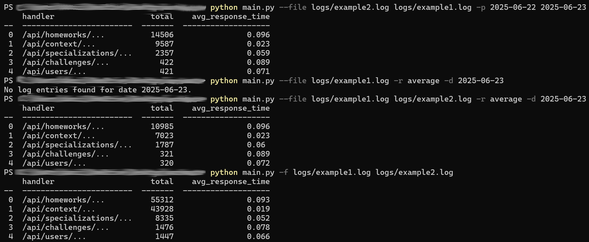
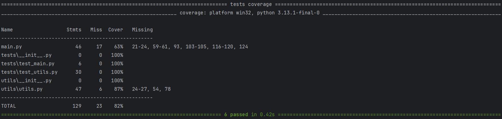

# Workmate

Скрипт для формирования отчётов по JSON-логам с возможностью фильтрации по дате или периоду.

## Установка и запуск

1. Клонирование репозитория:

   ```bash
   git clone https://github.com/DaniilKozhushko/workmate.git
   ```

   ```bash
   cd workmate
   ```
2. Установка и активация виртуального окружения:

   ```bash
   python3 -m venv venv
   ```
   
   ```bash
   source venv/bin/activate
   ```
   
4. Установка зависимостей:

   ```bash
   pip install -r requirements.txt
   ```

5. Запуск с параметрами:

	```bash
	python main.py --file <path> [--report <type>] [--date <date>] [--period <start_date> <end_date>]
	```
 
Допустимые параметры:

| Параметр     | Значение                                                             |
|--------------|----------------------------------------------------------------------|
| `-f`, `--file`   | путь к одному или нескольким JSON-логам (обязательно)                |
| `-r`, `--report` | тип отчёта (по умолчанию `average`)                                  |
| `-d`, `--date`   | дата для отчёта в формате YYYY-MM-DD                                 |
| `-p`, `--period` | период для отчёта: START_DATE END_DATE, формат YYYY-MM-DD YYYY-MM-DD |

## Примеры запуска скрипта и тестов



